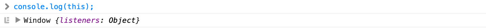

### this란?

`this`는 현재 실행 컨텍스트의 lexical environment에서 결정된다. 즉, 함수가 호출될 때 결정된다.

먼저 전역 실행 컨텍스트에서 `this`는 전역 객체를 참조한다. 웹 브라우저 콘솔창에서 확인해보면 window 객체를 확인할 수 있다 (웹 브라우저에서는 window 객체가 전역 객체이다).




Lexical environment가 변할 때마다 `this`가 바인딩된다. 즉, `this` 역시 상황에 따라 값이 변한다.

1. `new` 키워드와 함께 함수가 호출되면 함수 안의 `this`는 생성된 인스턴스로 바인딩된다.

```jsx
function Person() {
	this.age = 40;
}

var p1 = new Person();
console.log(p1.age); // 40
```

2. `apply`, `call`, `bind` 메서드와 함께 함수를 호출하면 함수 안의 this는 인자로 넘겨진 객체로 바인딩된다.

```jsx
const say = function(){
	console.log(`Hi, my name is ${this.name}.`);
};

const p1 = { name: 'jason' };
say.call(p1); // Hi, my name is jason.
```

3. 함수가 메소드로 호출될 경우(`.` notation이 사용될 경우), `this`는 해당 함수를 프로퍼티로 가지고 있는 객체다.

```jsx
var p1 = {
	name: 'jason',
	say: function() {
		return `Hi, my name is ${this.name}.`;
	}
};

console.log(p1.say()); // Hi, my name is jason.
```

4. 함수를 단순 호출할 경우 this는 strict mode 여부에 따라 다른 값을 참조한다. strict mode일 경우, `undefined`로 남아있는다. 아닐 경우에는 전역 객체인 `window`를 참조한다.

```jsx
function f1(){
	return this;
}

f1() === window; // 브라우저일 경우, true
```

5. 전역 실행 맥락에서 `this`는 strict mode와 관계 없이 전역 객체인 `window`를 참조한다.

6. 낮은 번호일수록 높은 우선순위를 갖는다.

7. ES6 화살표 함수(arrow function)에서는 위의 룰을 모두 무시하고, this의 값은 화살표 함수를 둘러싸는 lexical scope의 this 값을 사용한다. 만약 현재 범위에서 `this`가 존재하지 않는 경우, 바로 바깥 범위에서만 `this`를 찾는다.

```jsx
function Clock(){
	this.tick = 0;

	setInterval(() => {
		this.tick += 1; // this는 Clock 객체를 참조
	}, 1000); 
}

var clock = new Clock();
```


### 정리

- `this`는 현재 실행 컨텍스트의 lexical environment에서 결정된다.
- `this`는 다음의 룰을 따른다.
  1. `new` 키워드와 함께 함수가 호출되면 함수 안의 `this`는 생성된 인스턴스로 바인딩된다.
  2. `apply`, `call`, `bind` 메서드와 함께 함수를 호출하면 함수 안의 this는 인자로 넘겨진 객체로 바인딩된다.
  3. 함수가 메소드로 호출될 경우(`.` notation이 사용될 경우), `this`는 해당 함수를 프로퍼티로 가지고 있는 객체다.
  4. 함수를 단순 호출할 경우 this는 strict mode 여부에 따라 다른 값을 참조한다. strict mode일 경우, `undefined`로 남아있는다. 아닐 경우에는 전역 객체인 `window`를 참조한다.
  5. 전역 실행 맥락에서 `this`는 strict mode와 관계 없이 전역 객체인 `window`를 참조한다.
  6. 낮은 번호일수록 높은 우선순위를 갖는다.
  7. ES6 화살표 함수(arrow function)는 this를 바인딩하지 않는다. 자신을 둘러싸는 바로 바깥 범위 lexical scope의 `this`를 참조한다.


### 참고 자료

https://www.notion.so/JavaScript-this-b3a3764eca14475789a7816a3146495c#4c4dbf27f1eb4c3693d8b630c84f5e1e

https://www.notion.so/JavaScript-this-b3a3764eca14475789a7816a3146495c#14b7d7e2b402437c96b55e8768f79763